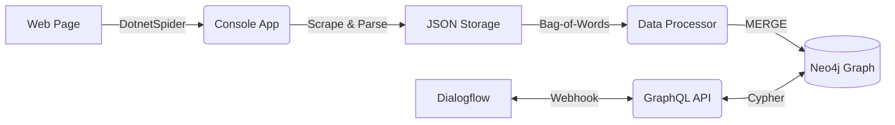

# Improving the Chatbot Experience: With a Content-Based Recommender System

This repository contains the reference implementation for [my thesis project](https://www.diva-portal.org/smash/get/diva2:1324846/FULLTEXT01.pdf) at Mid Sweden University (2019).

Chatbots often fall back to generic “I’m sorry, I don’t understand” replies whenever they can’t match user input to a scripted response. This leads to a poor user experience and missed opportunities for engagement.

My thesis project implemented a content-based recommender system to enrich chatbot fallbacks and deliver contextually relevant responses from a processed knowledge base.

---

## 🏛 System Architecture

The system was built as a modular pipeline that transforms unstructured web data into actionable chatbot responses.

- **Web Spider**: Uses `DotnetSpider` to crawl seed URLs and extract text.

- **NLP Engine**: A Bag-of-Words model that normalizes content and computes term frequencies.

- **Graph Store**: Ingests data into Neo4j, modeling weighted relationships between articles, paragraphs, and keywords.

- **GraphQL API**: Receives fallback queries from Dialogflow, traverses the graph to rank candidates, and returns the top recommendation.



---

## 🛠 Tech Stack & Tools (2019)

  **Environment**: Developed using Visual Studio and Neo4j Browser for graph visualization.

### Core Backend

- **Framework**: .NET Core 2.2

- **Language**: C# 7.3

- **API Architecture**: GraphQL for .NET

### Data Engineering & NLP

- **Web Crawler**: `DotnetSpider` (Scraping, Crawling, and XPath Parsing)

- **NLP Model**: Custom Bag-of-Words (BoW) implementation

- **Text Processing**: Regex-based normalization and custom Stop-word filtering

### Database & Storage

- **Graph Database**: Neo4j (Property Graph Model)

- **Query Language**: Cypher

- **Communication**: Neo4j Bolt Driver for .NET

### Conversational AI

- **Platform**: Dialogflow (V1)

- **Integration**: Webhook fulfillment via HTTPS/JSON

---

## 🛠 Implementation Details

### Data Acquisition & Extraction

- **Crawler Engine**: Built with `DotnetSpider` with a custom Selection Policy for domain-specific crawling.

- **Extraction Logic**: Utilized **XPath** for targeted scraping of metadata (keywords, summary) and paragraph content.

### NLP & Scoring Pipeline

1. **Crawl**: Console App triggers the `SimpleaSpider`.

2. **Store**: Data is persisted to JSON using `JsonFileStorage`.

3. **Process**: Custom `DataProcessor` performs:
    - **Text Normalization**: Lowercasing and regex-based punctuation removal.
    - **Tokenization**: Filtering through a custom `stopwords.txt`.
    - **Heuristic Scoring**: Calculating Word Count and Frequency Density to rank paragraph relevance.

### Graph Architecture

Data is modeled in **Neo4j** to allow for high-performance relationship traversal.

- **Nodes**: `Article`, `Paragraph`, `Word`.

- **Key Relationships**: `(Paragraph)-[:CONTAINS_WORD {count, frequency}]->(Word)`.

## Conclusion & Future Work (2026 Perspective)

The prototype successfully demonstrated that a weighted frequency approach can surface more relevant replies than a static default. If I were to rebuild this today with my current expertise, I would evolve the architecture into a modern **RAG** system:

- **Embeddings**: Replace Bag-of-Words with Vector Embeddings (e.g., OpenAI or HuggingFace).

- **Vector DB**: Use a dedicated Vector Database for semantic similarity search.

- **LLM Integration**: Use an LLM to summarize retrieved paragraphs for a more natural conversational flow.

## 📅 Changelog

[June 2019] – Thesis published on DiVA.

[Jan 2026] – System architecture and documentation made public.

## Citation

```
@misc{gardner2019improving,
  author        = {Angelica Hjelm Gardner},
  title         = {Improving the Chatbot Experience: With a Content-Based Recommender System},
  howpublished  = {University Diploma Project, Mid Sweden University},
  year          = {2019},
  url           = {https://github.com/angelicagardner/chatbot-fallback-experience}
}
```
